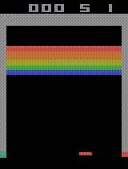
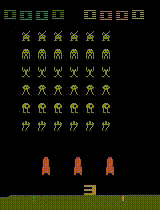

# Deep Reinforcement Learning - Atari 2600

## Results

## A2C

| Pong | Breakout | SpaceInvaders | Seaquest | StarGunner | Frostbite
| ---- | ----| ---- | ---- | ---- | ----
|  |  |  |  |  | 
| Model weights | Model weights | Model weights | Model weights | Model weights | Model weights

## DQN

| Pong | Breakout | SpaceInvaders | Seaquest | StarGunner
| ---- | ----| ---- | ---- | ----
|  |  |  |  | 
| Model weights | Model weights | Model weights | Model weights | Model weights
